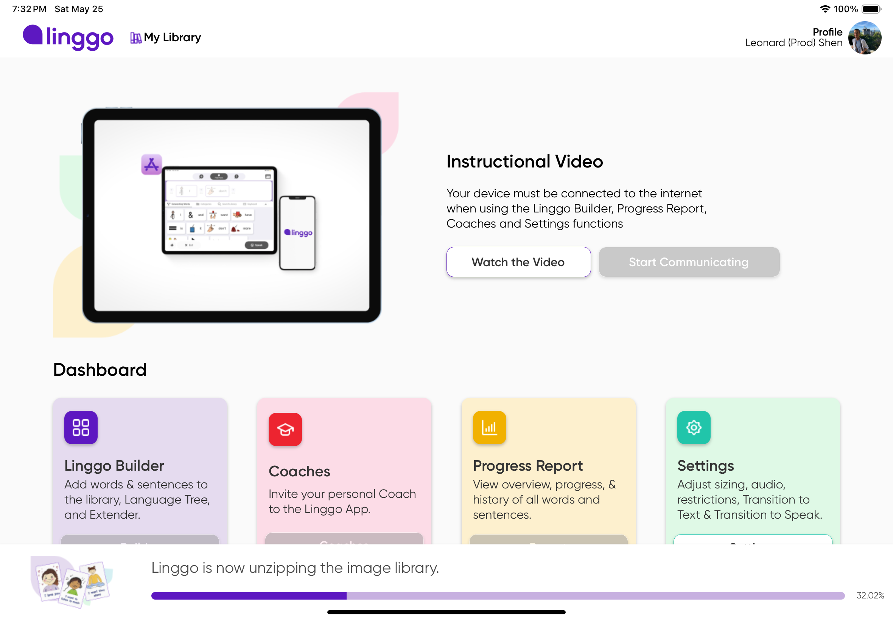
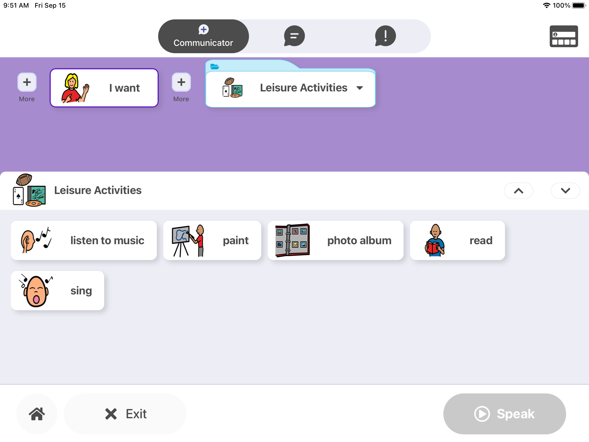

<!-- reference: https://towardsdatascience.com/build-a-stunning-readme-for-your-github-profile-9b80434fe5d7 -->

## Hey I'm Leonard! 👋

I'm a Full Stack Developer with emphasis on frontend web & react native mobile development. I have been doing this professionally for 3 years. Prior to this, I learned by teaching myself building personal projects.

⏳ Overall, while I have spent over 70% of my experience in Frontend developer, I enjoy being part of the end-to-end process of software development, which includes cloud architecture with AWS. I'm passionate about making stuff work and delivering it to users!

🚢 In my previous role as a React Native developer, I implemented features, managed multiple code bases and their product release cycles. I shipped code to the web and to the iOS/Android Stores.

🏰 I am entrepreneurial. I like to always reference business goals and user benefits while I do my work.

🐍 Currently, I'm helping a small start up on both frontend and backend, while grinding away at [Leetcode](https://leetcode.com/leonardshen/).

### Tools I enjoy using to help me deliver the goods:

<!-- use https://simpleicons.org/ to find icons and colors -->

### What people say about me:

> I hired Leonard to build a prototype mobile app to help accountants in Canada keep track of their industry education hours. Not only did Leonard build the app according to the specifications I laid out, but he also did his own research and built the app according to the different provincial CPA rules in Canada. Leonard is very easy to work with and I would definitely recommend him as a software programmer.
>
> **Garth Sheriff - Principal, Sheriff Consulting**
> 
:memo: [Click here to chew on my résumé](leonard_shen_resume_20241117.pdf)

:calendar: [Click here to book an e-coffee chat](https://calendly.com/leonard-shen)

:skull: [Click here to critique my linkedin](https://www.linkedin.com/in/leonard-shen/)

## Previous roles / projects
### Linggo
Linggo is an mobile app that assists people with learning disabilities to communicate. 
>
Technologies used:
>

Here are a few screen shots:

<figure>
    <figcaption>Download progress bar</figcaption>
    
</figure>
<figure>
    <figcaption>Redesigned dropdown</figcaption>
    
</figure>

### CPD Tracker
CPD Tracker for Sheriff Consulting was a prototype React Native project, designed for CPAs in Canada to keep track of their professional education hours.
>
Technologies used:
>

     

